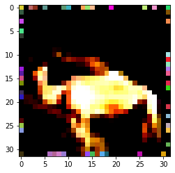
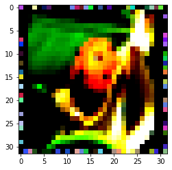

# RandomOutline

Data Augmentation with Random Outline Processing

## About

 

Fill outline with random color with parameter `p`. Bigger `p`, Larger outline size.

Trained models are [here](model/).

All jupyter notebook codes are [here](ipynb/notebook.ipynb)

## import

```python
import numpy as np
import time
import random
import torch
import torch.nn as nn
import torch.nn.functional as F
from torch.autograd import Variable
import torch.backends.cudnn as cudnn
from torch.optim.lr_scheduler import MultiStepLR

from torchvision import datasets, transforms

from tqdm.notebook import tqdm as tqdm
```

## transforms

```python
train_transform = transforms.Compose([])
train_transform.transforms.append(transforms.RandomCrop(32, padding=4))
train_transform.transforms.append(transforms.RandomHorizontalFlip())
train_transform.transforms.append(transforms.ToTensor())
train_transform.transforms.append(normalize)
train_transform.transforms.append(RandomOutline(0.05))
```

## result

Best Top-1 Accuracy: 77.84

Best Top-5 Accuracy: 94.13

result outputs are [here](result/).
